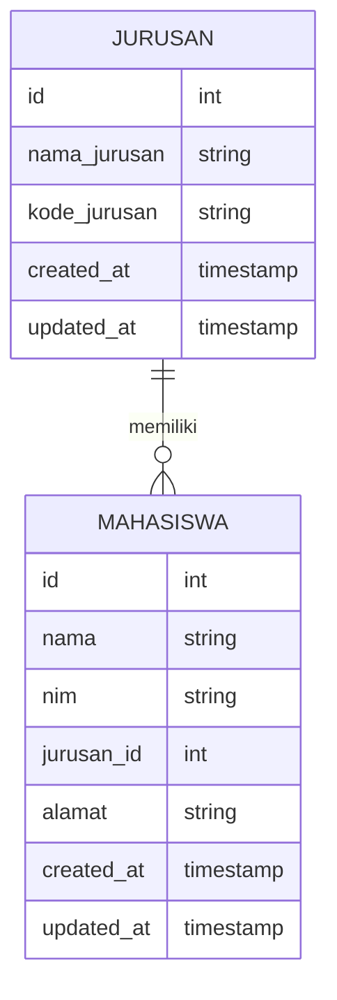
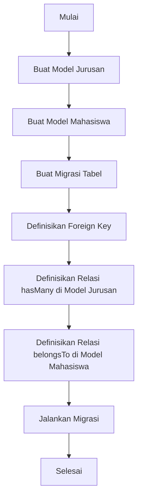

# Relationship Antar Tabel (One-to-Many) di Laravel

Pada artikel ini, kita akan mempelajari konsep relationship antar tabel, khususnya One-to-Many di Laravel. Mari belajar cara menghubungkan model Mahasiswa dengan Jurusan dalam aplikasi mahasiswa-app kita.

## Apa itu Relationship One-to-Many?

Relationship One-to-Many adalah hubungan di mana satu record dari tabel pertama dapat berhubungan dengan banyak record di tabel kedua. Dalam konteks aplikasi kita:

- Satu Jurusan dapat memiliki banyak Mahasiswa
- Tetapi satu Mahasiswa hanya dapat memiliki satu Jurusan



## Langkah-langkah Implementasi One-to-Many

### 1. Membuat Model dan Migrasi Jurusan

Pertama, kita perlu membuat model dan migrasi untuk tabel Jurusan:

```bash
php artisan make:model Jurusan -m
```

Perintah ini akan membuat file model `Jurusan.php` dan file migrasi untuk tabel jurusan.

### 2. Mengatur Migrasi Tabel Jurusan

Edit file migrasi untuk tabel jurusan:

```php
public function up()
{
    Schema::create('jurusans', function (Blueprint $table) {
        $table->id();
        $table->string('nama_jurusan');
        $table->string('kode_jurusan')->unique();
        $table->timestamps();
    });
}
```

### 3. Modifikasi Migrasi Tabel Mahasiswa

Kita perlu menambahkan kolom `jurusan_id` sebagai foreign key di tabel mahasiswa:

```php
public function up()
{
    Schema::create('mahasiswas', function (Blueprint $table) {
        $table->id();
        $table->string('nama');
        $table->string('nim')->unique();
        $table->foreignId('jurusan_id')->constrained('jurusans');
        $table->text('alamat')->nullable();
        $table->timestamps();
    });
}
```

### 4. Mendefinisikan Relasi di Model

#### Model Jurusan

```php
namespace App\Models;

use Illuminate\Database\Eloquent\Factories\HasFactory;
use Illuminate\Database\Eloquent\Model;

class Jurusan extends Model
{
    use HasFactory;
    
    protected $fillable = ['nama_jurusan', 'kode_jurusan'];
    
    // Definisi relasi One-to-Many dengan Mahasiswa
    public function mahasiswas()
    {
        return $this->hasMany(Mahasiswa::class);
    }
}
```

#### Model Mahasiswa

```php
namespace App\Models;

use Illuminate\Database\Eloquent\Factories\HasFactory;
use Illuminate\Database\Eloquent\Model;

class Mahasiswa extends Model
{
    use HasFactory;
    
    protected $fillable = ['nama', 'nim', 'jurusan_id', 'alamat'];
    
    // Definisi relasi balik ke Jurusan
    public function jurusan()
    {
        return $this->belongsTo(Jurusan::class);
    }
}
```

## Alur Proses Relationship One-to-Many



## Menggunakan Relasi dalam Kode

### 1. Menyimpan data dengan relasi

```php
// Membuat jurusan baru
$jurusan = Jurusan::create([
    'nama_jurusan' => 'Teknik Informatika',
    'kode_jurusan' => 'TI'
]);

// Membuat mahasiswa dengan relasi ke jurusan
$mahasiswa = Mahasiswa::create([
    'nama' => 'Budi Santoso',
    'nim' => '12345678',
    'jurusan_id' => $jurusan->id,
    'alamat' => 'Jl. Contoh No. 123'
]);

// Atau bisa juga menggunakan cara ini
$mahasiswa = new Mahasiswa([
    'nama' => 'Ani Wijaya',
    'nim' => '87654321',
    'alamat' => 'Jl. Contoh No. 456'
]);

$jurusan->mahasiswas()->save($mahasiswa);
```

### 2. Mengambil data dengan relasi

```php
// Mendapatkan semua mahasiswa beserta data jurusannya
$mahasiswas = Mahasiswa::with('jurusan')->get();

// Menampilkan data jurusan dari mahasiswa
foreach ($mahasiswas as $mahasiswa) {
    echo $mahasiswa->nama . ' - ' . $mahasiswa->jurusan->nama_jurusan;
}

// Mendapatkan semua mahasiswa dari jurusan tertentu
$jurusan = Jurusan::find(1);
$mahasiswasJurusan = $jurusan->mahasiswas;

// Menghitung jumlah mahasiswa di suatu jurusan
$jumlahMahasiswa = $jurusan->mahasiswas()->count();
```

## Menampilkan Data Relasi di View

Untuk menampilkan data relasi di view, kita bisa mengirim data yang sudah disertakan relasinya:

```php
// Di Controller
public function index()
{
    $mahasiswas = Mahasiswa::with('jurusan')->paginate(10);
    return view('mahasiswa.index', compact('mahasiswas'));
}
```

Dan di view, kita bisa akses data relasi:

```blade
<table class="table">
    <thead>
        <tr>
            <th>Nama</th>
            <th>NIM</th>
            <th>Jurusan</th>
            <th>Alamat</th>
        </tr>
    </thead>
    <tbody>
        @foreach($mahasiswas as $mahasiswa)
        <tr>
            <td>{{ $mahasiswa->nama }}</td>
            <td>{{ $mahasiswa->nim }}</td>
            <td>{{ $mahasiswa->jurusan->nama_jurusan }}</td>
            <td>{{ $mahasiswa->alamat }}</td>
        </tr>
        @endforeach
    </tbody>
</table>
```

## Filtering Data Berdasarkan Relasi

Kita juga bisa melakukan filter data berdasarkan relasi:

```php
// Mencari mahasiswa dari jurusan Teknik Informatika
$mahasiswaTI = Mahasiswa::whereHas('jurusan', function($query) {
    $query->where('nama_jurusan', 'Teknik Informatika');
})->get();

// Mencari mahasiswa yang belum memiliki jurusan
$mahasiswaTanpaJurusan = Mahasiswa::whereDoesntHave('jurusan')->get();
```

## Kesimpulan

Relationship One-to-Many di Laravel memudahkan kita menghubungkan data antar tabel yang saling berhubungan. Dengan menggunakan relasi ini, kita dapat dengan mudah mengakses data terkait tanpa perlu menulis query JOIN yang kompleks.

Pada contoh kasus Mahasiswa-Jurusan, kita bisa dengan mudah mendapatkan informasi jurusan dari seorang mahasiswa atau mendapatkan semua mahasiswa dari suatu jurusan.

Pada pertemuan selanjutnya, kita akan mengeksplorasi relasi lebih kompleks dengan Many-to-Many relationship antara Mahasiswa dan Mata Kuliah.