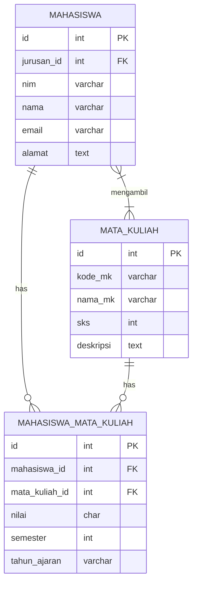
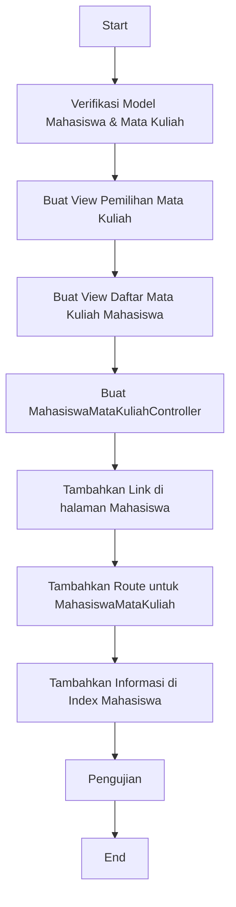

# Menghubungkan Mahasiswa dengan Tabel Mata Kuliah

Pada tutorial kali ini, kita akan fokus pada implementasi praktis untuk menghubungkan model Mahasiswa dengan model Mata Kuliah. Kita akan membahas cara mengintegrasikan dua tabel ini dalam aplikasi Laravel mahasiswa-app yang sedang kita kembangkan.

## Diagram Hubungan Mahasiswa dan Mata Kuliah



## Langkah 1: Verifikasi Model dan Migrasi

Sebelum memulai proses penghubungan, pastikan kita sudah memiliki model dan migrasi yang dibutuhkan. Mari kita verifikasi file-file yang diperlukan.

### Verifikasi Model Mahasiswa

File: `app/Models/Mahasiswa.php`
```php
<?php

namespace App\Models;

use Illuminate\Database\Eloquent\Factories\HasFactory;
use Illuminate\Database\Eloquent\Model;

class Mahasiswa extends Model
{
    use HasFactory;
    
    protected $fillable = ['jurusan_id', 'nim', 'nama', 'email', 'alamat'];
    
    // Relasi ke jurusan
    public function jurusan()
    {
        return $this->belongsTo(Jurusan::class);
    }
    
    // Relasi ke mata kuliah
    public function mataKuliahs()
    {
        return $this->belongsToMany(MataKuliah::class, 'mahasiswa_mata_kuliah')
                    ->withPivot('nilai', 'semester', 'tahun_ajaran')
                    ->withTimestamps();
    }
}
```

### Verifikasi Model Mata Kuliah

File: `app/Models/MataKuliah.php`
```php
<?php

namespace App\Models;

use Illuminate\Database\Eloquent\Factories\HasFactory;
use Illuminate\Database\Eloquent\Model;

class MataKuliah extends Model
{
    use HasFactory;
    
    protected $fillable = ['kode_mk', 'nama_mk', 'sks', 'deskripsi'];
    
    // Relasi ke mahasiswa
    public function mahasiswas()
    {
        return $this->belongsToMany(Mahasiswa::class, 'mahasiswa_mata_kuliah')
                    ->withPivot('nilai', 'semester', 'tahun_ajaran')
                    ->withTimestamps();
    }
}
```

## Langkah 2: Membuat Interface Pengambilan Mata Kuliah

Untuk menghubungkan mahasiswa dengan mata kuliah, kita perlu membuat antarmuka yang memungkinkan pengguna untuk memilih mata kuliah yang akan diambil oleh mahasiswa.

### Membuat View untuk Pemilihan Mata Kuliah

Buat file `resources/views/mahasiswas/pilih_mata_kuliah.blade.php`:

```html
@extends('layouts.app')

@section('content')
<div class="container">
    <h2>Pilih Mata Kuliah untuk {{ $mahasiswa->nama }}</h2>
    
    @if (session('success'))
        <div class="alert alert-success">
            {{ session('success') }}
        </div>
    @endif
    
    <div class="card mb-4">
        <div class="card-header">
            <h5 class="mb-0">Informasi Mahasiswa</h5>
        </div>
        <div class="card-body">
            <div class="row">
                <div class="col-md-6">
                    <p><strong>NIM:</strong> {{ $mahasiswa->nim }}</p>
                    <p><strong>Nama:</strong> {{ $mahasiswa->nama }}</p>
                </div>
                <div class="col-md-6">
                    <p><strong>Jurusan:</strong> {{ $mahasiswa->jurusan->nama_jurusan }}</p>
                    <p><strong>Email:</strong> {{ $mahasiswa->email }}</p>
                </div>
            </div>
        </div>
    </div>
    
    <form action="{{ route('mahasiswas.mata_kuliah.store', $mahasiswa->id) }}" method="POST">
        @csrf
        
        <div class="card">
            <div class="card-header">
                <div class="d-flex justify-content-between align-items-center">
                    <h5 class="mb-0">Pilih Mata Kuliah</h5>
                    <div>
                        <div class="form-row align-items-center">
                            <div class="col-auto">
                                <label for="semester">Semester:</label>
                                <select name="semester" id="semester" class="form-control form-control-sm" required>
                                    @for ($i = 1; $i <= 8; $i++)
                                        <option value="{{ $i }}">{{ $i }}</option>
                                    @endfor
                                </select>
                            </div>
                            <div class="col-auto">
                                <label for="tahun_ajaran">Tahun Ajaran:</label>
                                <select name="tahun_ajaran" id="tahun_ajaran" class="form-control form-control-sm" required>
                                    @php
                                        $currentYear = date('Y');
                                    @endphp
                                    @for ($i = $currentYear - 2; $i <= $currentYear + 1; $i++)
                                        <option value="{{ $i }}/{{ $i+1 }}">{{ $i }}/{{ $i+1 }}</option>
                                    @endfor
                                </select>
                            </div>
                        </div>
                    </div>
                </div>
            </div>
            <div class="card-body">
                @if ($mataKuliahs->count() > 0)
                    <div class="row">
                        @foreach ($mataKuliahs as $mk)
                        <div class="col-md-6 mb-3">
                            <div class="card h-100">
                                <div class="card-body">
                                    <div class="form-check">
                                        <input class="form-check-input" type="checkbox" name="mata_kuliah_ids[]" value="{{ $mk->id }}" id="mk{{ $mk->id }}">
                                        <label class="form-check-label" for="mk{{ $mk->id }}">
                                            <h5 class="card-title">{{ $mk->kode_mk }} - {{ $mk->nama_mk }}</h5>
                                            <h6 class="card-subtitle mb-2 text-muted">{{ $mk->sks }} SKS</h6>
                                            <p class="card-text">{{ $mk->deskripsi }}</p>
                                        </label>
                                    </div>
                                </div>
                            </div>
                        </div>
                        @endforeach
                    </div>
                @else
                    <div class="alert alert-info">
                        Belum ada mata kuliah yang tersedia.
                    </div>
                @endif
            </div>
            <div class="card-footer">
                <button type="submit" class="btn btn-primary">Simpan Mata Kuliah</button>
                <a href="{{ route('mahasiswas.show', $mahasiswa->id) }}" class="btn btn-secondary">Kembali</a>
            </div>
        </div>
    </form>
</div>
@endsection
```

## Langkah 3: Membuat View untuk Menampilkan Mata Kuliah yang Diambil

Buat file `resources/views/mahasiswas/mata_kuliah.blade.php`:

```html
@extends('layouts.app')

@section('content')
<div class="container">
    <h2>Mata Kuliah yang Diambil - {{ $mahasiswa->nama }}</h2>
    
    @if (session('success'))
        <div class="alert alert-success">
            {{ session('success') }}
        </div>
    @endif
    
    <div class="card mb-4">
        <div class="card-header">
            <div class="d-flex justify-content-between align-items-center">
                <h5 class="mb-0">Daftar Mata Kuliah</h5>
                <div>
                    <form action="{{ route('mahasiswas.mata_kuliah.index', $mahasiswa->id) }}" method="GET" class="form-inline">
                        <div class="form-row align-items-center">
                            <div class="col-auto">
                                <label for="filter_semester" class="sr-only">Semester</label>
                                <select name="semester" id="filter_semester" class="form-control form-control-sm">
                                    <option value="">Semua Semester</option>
                                    @for ($i = 1; $i <= 8; $i++)
                                        <option value="{{ $i }}" {{ request('semester') == $i ? 'selected' : '' }}>Semester {{ $i }}</option>
                                    @endfor
                                </select>
                            </div>
                            <div class="col-auto">
                                <label for="filter_tahun" class="sr-only">Tahun Ajaran</label>
                                <select name="tahun_ajaran" id="filter_tahun" class="form-control form-control-sm">
                                    <option value="">Semua Tahun</option>
                                    @foreach ($tahunAjarans as $tahun)
                                        <option value="{{ $tahun }}" {{ request('tahun_ajaran') == $tahun ? 'selected' : '' }}>{{ $tahun }}</option>
                                    @endforeach
                                </select>
                            </div>
                            <div class="col-auto">
                                <button type="submit" class="btn btn-sm btn-primary">Filter</button>
                                <a href="{{ route('mahasiswas.mata_kuliah.index', $mahasiswa->id) }}" class="btn btn-sm btn-secondary">Reset</a>
                            </div>
                        </div>
                    </form>
                </div>
            </div>
        </div>
        <div class="card-body">
            @if ($mataKuliahs->count() > 0)
                <table class="table table-bordered table-striped">
                    <thead>
                        <tr>
                            <th>Kode MK</th>
                            <th>Nama Mata Kuliah</th>
                            <th>SKS</th>
                            <th>Semester</th>
                            <th>Tahun Ajaran</th>
                            <th>Nilai</th>
                            <th>Aksi</th>
                        </tr>
                    </thead>
                    <tbody>
                        @php $totalSKS = 0; @endphp
                        @foreach ($mataKuliahs as $mk)
                            @php $totalSKS += $mk->sks; @endphp
                            <tr>
                                <td>{{ $mk->kode_mk }}</td>
                                <td>{{ $mk->nama_mk }}</td>
                                <td>{{ $mk->sks }}</td>
                                <td>{{ $mk->pivot->semester }}</td>
                                <td>{{ $mk->pivot->tahun_ajaran }}</td>
                                <td>
                                    @if ($mk->pivot->nilai)
                                        <span class="badge badge-{{ $mk->pivot->nilai == 'A' || $mk->pivot->nilai == 'B' ? 'success' : ($mk->pivot->nilai == 'C' ? 'warning' : 'danger') }}">
                                            {{ $mk->pivot->nilai }}
                                        </span>
                                    @else
                                        <form action="{{ route('mahasiswas.mata_kuliah.nilai', [$mahasiswa->id, $mk->id]) }}" method="POST" class="form-inline">
                                            @csrf
                                            <select name="nilai" class="form-control form-control-sm mr-2">
                                                <option value="">-</option>
                                                <option value="A">A</option>
                                                <option value="B">B</option>
                                                <option value="C">C</option>
                                                <option value="D">D</option>
                                                <option value="E">E</option>
                                            </select>
                                            <input type="hidden" name="semester" value="{{ $mk->pivot->semester }}">
                                            <input type="hidden" name="tahun_ajaran" value="{{ $mk->pivot->tahun_ajaran }}">
                                            <button type="submit" class="btn btn-sm btn-primary">Simpan</button>
                                        </form>
                                    @endif
                                </td>
                                <td>
                                    <form action="{{ route('mahasiswas.mata_kuliah.destroy', [$mahasiswa->id, $mk->id]) }}" method="POST">
                                        @csrf
                                        @method('DELETE')
                                        <input type="hidden" name="semester" value="{{ $mk->pivot->semester }}">
                                        <input type="hidden" name="tahun_ajaran" value="{{ $mk->pivot->tahun_ajaran }}">
                                        <button type="submit" class="btn btn-sm btn-danger" onclick="return confirm('Yakin ingin menghapus mata kuliah ini?')">Hapus</button>
                                    </form>
                                </td>
                            </tr>
                        @endforeach
                        <tr>
                            <td colspan="2" class="text-right"><strong>Total SKS:</strong></td>
                            <td colspan="5"><strong>{{ $totalSKS }}</strong></td>
                        </tr>
                    </tbody>
                </table>
            @else
                <div class="alert alert-info">
                    Belum ada mata kuliah yang diambil.
                </div>
            @endif
        </div>
        <div class="card-footer">
            <a href="{{ route('mahasiswas.mata_kuliah.create', $mahasiswa->id) }}" class="btn btn-primary">Tambah Mata Kuliah</a>
            <a href="{{ route('mahasiswas.show', $mahasiswa->id) }}" class="btn btn-secondary">Kembali ke Detail Mahasiswa</a>
        </div>
    </div>
</div>
@endsection
```

## Langkah 4: Membuat Controller untuk Mengelola Relasi

Buat file `app/Http/Controllers/MahasiswaMataKuliahController.php`:

```php
<?php

namespace App\Http\Controllers;

use App\Models\Mahasiswa;
use App\Models\MataKuliah;
use Illuminate\Http\Request;

class MahasiswaMataKuliahController extends Controller
{
    // Menampilkan mata kuliah yang diambil mahasiswa
    public function index(Request $request, $mahasiswaId)
    {
        $mahasiswa = Mahasiswa::findOrFail($mahasiswaId);
        
        // Query dasar
        $query = $mahasiswa->mataKuliahs();
        
        // Filter berdasarkan semester jika ada
        if ($request->has('semester') && $request->semester != '') {
            $query->wherePivot('semester', $request->semester);
        }
        
        // Filter berdasarkan tahun ajaran jika ada
        if ($request->has('tahun_ajaran') && $request->tahun_ajaran != '') {
            $query->wherePivot('tahun_ajaran', $request->tahun_ajaran);
        }
        
        // Ambil mata kuliah
        $mataKuliahs = $query->get();
        
        // Ambil semua tahun ajaran yang tersedia untuk filter
        $tahunAjarans = $mahasiswa->mataKuliahs()
                                  ->distinct()
                                  ->pluck('tahun_ajaran')
                                  ->toArray();
        
        return view('mahasiswas.mata_kuliah', compact('mahasiswa', 'mataKuliahs', 'tahunAjarans'));
    }
    
    // Form untuk memilih mata kuliah
    public function create($mahasiswaId)
    {
        $mahasiswa = Mahasiswa::findOrFail($mahasiswaId);
        $mataKuliahs = MataKuliah::all();
        
        return view('mahasiswas.pilih_mata_kuliah', compact('mahasiswa', 'mataKuliahs'));
    }
    
    // Menyimpan mata kuliah yang dipilih
    public function store(Request $request, $mahasiswaId)
    {
        $request->validate([
            'mata_kuliah_ids' => 'required|array',
            'mata_kuliah_ids.*' => 'exists:mata_kuliahs,id',
            'semester' => 'required|integer|between:1,8',
            'tahun_ajaran' => 'required|string'
        ]);
        
        $mahasiswa = Mahasiswa::findOrFail($mahasiswaId);
        
        // Data untuk pivot table
        $pivotData = [
            'semester' => $request->semester,
            'tahun_ajaran' => $request->tahun_ajaran
        ];
        
        // Tambahkan mata kuliah ke mahasiswa
        foreach ($request->mata_kuliah_ids as $mkId) {
            // Periksa apakah relasi sudah ada dengan semester dan tahun ajaran yang sama
            if (!$mahasiswa->mataKuliahs()
                            ->wherePivot('mata_kuliah_id', $mkId)
                            ->wherePivot('semester', $request->semester)
                            ->wherePivot('tahun_ajaran', $request->tahun_ajaran)
                            ->exists()) {
                $mahasiswa->mataKuliahs()->attach($mkId, $pivotData);
            }
        }
        
        return redirect()->route('mahasiswas.mata_kuliah.index', $mahasiswa->id)
                        ->with('success', 'Mata kuliah berhasil ditambahkan');
    }
    
    // Input nilai untuk mata kuliah
    public function inputNilai(Request $request, $mahasiswaId, $mataKuliahId)
    {
        $request->validate([
            'nilai' => 'required|in:A,B,C,D,E',
            'semester' => 'required|integer',
            'tahun_ajaran' => 'required|string'
        ]);
        
        $mahasiswa = Mahasiswa::findOrFail($mahasiswaId);
        
        // Update nilai pada pivot
        $mahasiswa->mataKuliahs()->updateExistingPivot(
            $mataKuliahId, 
            [
                'nilai' => $request->nilai
            ],
            false // tidak otomatis update timestamp
        );
        
        return redirect()->route('mahasiswas.mata_kuliah.index', [
            'mahasiswa' => $mahasiswa->id,
            'semester' => $request->semester,
            'tahun_ajaran' => $request->tahun_ajaran
        ])->with('success', 'Nilai berhasil disimpan');
    }
    
    // Menghapus mata kuliah dari mahasiswa
    public function destroy(Request $request, $mahasiswaId, $mataKuliahId)
    {
        $request->validate([
            'semester' => 'required|integer',
            'tahun_ajaran' => 'required|string'
        ]);
        
        $mahasiswa = Mahasiswa::findOrFail($mahasiswaId);
        
        // Menghapus relasi dengan kondisi semester dan tahun ajaran
        $mahasiswa->mataKuliahs()
                  ->wherePivot('mata_kuliah_id', $mataKuliahId)
                  ->wherePivot('semester', $request->semester)
                  ->wherePivot('tahun_ajaran', $request->tahun_ajaran)
                  ->detach();
        
        return redirect()->route('mahasiswas.mata_kuliah.index', [
            'mahasiswa' => $mahasiswa->id,
            'semester' => $request->semester,
            'tahun_ajaran' => $request->tahun_ajaran
        ])->with('success', 'Mata kuliah berhasil dihapus');
    }
}
```

## Langkah 5: Menambahkan Link ke Halaman Mahasiswa

Edit file `resources/views/mahasiswas/show.blade.php` untuk menambahkan link ke manajemen mata kuliah:

```html
@extends('layouts.app')

@section('content')
<div class="container">
    <h2>Detail Mahasiswa</h2>
    
    @if (session('success'))
        <div class="alert alert-success">
            {{ session('success') }}
        </div>
    @endif
    
    <div class="card mb-4">
        <div class="card-header">
            <h5 class="mb-0">Informasi Mahasiswa</h5>
        </div>
        <div class="card-body">
            <div class="row">
                <div class="col-md-6">
                    <p><strong>NIM:</strong> {{ $mahasiswa->nim }}</p>
                    <p><strong>Nama:</strong> {{ $mahasiswa->nama }}</p>
                    <p><strong>Email:</strong> {{ $mahasiswa->email }}</p>
                    <p><strong>Jurusan:</strong> {{ $mahasiswa->jurusan->nama_jurusan }}</p>
                </div>
                <div class="col-md-6">
                    <p><strong>Alamat:</strong></p>
                    <p>{{ $mahasiswa->alamat ?: '-' }}</p>
                </div>
            </div>
        </div>
        <div class="card-footer">
            <a href="{{ route('mahasiswas.edit', $mahasiswa->id) }}" class="btn btn-warning">Edit</a>
            <a href="{{ route('mahasiswas.index') }}" class="btn btn-secondary">Kembali</a>
        </div>
    </div>
    
    <div class="card">
        <div class="card-header">
            <h5 class="mb-0">Mata Kuliah</h5>
        </div>
        <div class="card-body">
            <a href="{{ route('mahasiswas.mata_kuliah.index', $mahasiswa->id) }}" class="btn btn-info">Lihat Mata Kuliah</a>
            <a href="{{ route('mahasiswas.mata_kuliah.create', $mahasiswa->id) }}" class="btn btn-primary">Tambah Mata Kuliah</a>
        </div>
    </div>
</div>
@endsection
```

## Langkah 6: Menambahkan Rute untuk Mengelola Relasi

Edit file `routes/web.php` untuk menambahkan rute-rute yang diperlukan:

```php
// Rute untuk mengelola mata kuliah mahasiswa
Route::get('mahasiswas/{mahasiswa}/mata-kuliah', [MahasiswaMataKuliahController::class, 'index'])
     ->name('mahasiswas.mata_kuliah.index');
Route::get('mahasiswas/{mahasiswa}/mata-kuliah/create', [MahasiswaMataKuliahController::class, 'create'])
     ->name('mahasiswas.mata_kuliah.create');
Route::post('mahasiswas/{mahasiswa}/mata-kuliah', [MahasiswaMataKuliahController::class, 'store'])
     ->name('mahasiswas.mata_kuliah.store');
Route::post('mahasiswas/{mahasiswa}/mata-kuliah/{mataKuliah}/nilai', [MahasiswaMataKuliahController::class, 'inputNilai'])
     ->name('mahasiswas.mata_kuliah.nilai');
Route::delete('mahasiswas/{mahasiswa}/mata-kuliah/{mataKuliah}', [MahasiswaMataKuliahController::class, 'destroy'])
     ->name('mahasiswas.mata_kuliah.destroy');
```

## Langkah 7: Mengatur Tampilan Data di View Mahasiswa

Edit file `resources/views/mahasiswas/index.blade.php` untuk menambahkan informasi jumlah mata kuliah:

```html
@extends('layouts.app')

@section('content')
<div class="container">
    <h2>Daftar Mahasiswa</h2>
    
    <div class="mb-3">
        <a href="{{ route('mahasiswas.create') }}" class="btn btn-primary">Tambah Mahasiswa</a>
    </div>
    
    @if (session('success'))
        <div class="alert alert-success">
            {{ session('success') }}
        </div>
    @endif
    
    <div class="card">
        <div class="card-body">
            <table class="table table-bordered table-hover">
                <thead>
                    <tr>
                        <th>NIM</th>
                        <th>Nama</th>
                        <th>Email</th>
                        <th>Jurusan</th>
                        <th>Jumlah MK</th>
                        <th>Aksi</th>
                    </tr>
                </thead>
                <tbody>
                    @forelse ($mahasiswas as $mahasiswa)
                    <tr>
                        <td>{{ $mahasiswa->nim }}</td>
                        <td>{{ $mahasiswa->nama }}</td>
                        <td>{{ $mahasiswa->email }}</td>
                        <td>{{ $mahasiswa->jurusan->nama_jurusan }}</td>
                        <td>{{ $mahasiswa->mataKuliahs->count() }}</td>
                        <td>
                            <a href="{{ route('mahasiswas.show', $mahasiswa->id) }}" class="btn btn-sm btn-info">Detail</a>
                            <a href="{{ route('mahasiswas.edit', $mahasiswa->id) }}" class="btn btn-sm btn-warning">Edit</a>
                            <a href="{{ route('mahasiswas.mata_kuliah.index', $mahasiswa->id) }}" class="btn btn-sm btn-primary">Mata Kuliah</a>
                            <form action="{{ route('mahasiswas.destroy', $mahasiswa->id) }}" method="POST" class="d-inline">
                                @csrf
                                @method('DELETE')
                                <button type="submit" class="btn btn-sm btn-danger" onclick="return confirm('Yakin ingin menghapus data ini?')">Hapus</button>
                            </form>
                        </td>
                    </tr>
                    @empty
                    <tr>
                        <td colspan="6" class="text-center">Tidak ada data mahasiswa</td>
                    </tr>
                    @endforelse
                </tbody>
            </table>
        </div>
    </div>
</div>
@endsection
```

## Flowchart Proses Menghubungkan Mahasiswa dengan Mata Kuliah



## Contoh Query Praktis

Berikut adalah beberapa contoh query yang dapat Anda gunakan untuk mengakses dan memanipulasi data relasi Mahasiswa-Mata Kuliah:

### 1. Mengambil Semua Mata Kuliah yang Diambil oleh Mahasiswa Tertentu

```php
$mahasiswa = Mahasiswa::find(1);
$mataKuliahs = $mahasiswa->mataKuliahs;
```

### 2. Mengambil Data dengan Filter Semester dan Tahun Ajaran

```php
$mahasiswa = Mahasiswa::find(1);
$mataKuliahs = $mahasiswa->mataKuliahs()
    ->wherePivot('semester', 1)
    ->wherePivot('tahun_ajaran', '2023/2024')
    ->get();
```

### 3. Menambahkan Mata Kuliah untuk Mahasiswa

```php
$mahasiswa = Mahasiswa::find(1);
$mahasiswa->mataKuliahs()->attach(2, [
    'semester' => 1,
    'tahun_ajaran' => '2023/2024'
]);
```

### 4. Menghapus Mata Kuliah dari Mahasiswa

```php
$mahasiswa = Mahasiswa::find(1);
$mahasiswa->mataKuliahs()
    ->wherePivot('mata_kuliah_id', 2)
    ->wherePivot('semester', 1)
    ->wherePivot('tahun_ajaran', '2023/2024')
    ->detach();
```

### 5. Mengupdate Nilai Mata Kuliah

```php
$mahasiswa = Mahasiswa::find(1);
$mahasiswa->mataKuliahs()->updateExistingPivot(2, [
    'nilai' => 'A'
]);
```

### 6. Mencari Mahasiswa yang Mengambil Mata Kuliah Tertentu

```php
$mahasiswas = Mahasiswa::whereHas('mataKuliahs', function($query) {
    $query->where('mata_kuliah_id', 2);
})->get();
```

### 7. Mencari Mata Kuliah yang Diambil oleh Banyak Mahasiswa (Populer)

```php
$popularMataKuliahs = MataKuliah::withCount('mahasiswas')
    ->orderByDesc('mahasiswas_count')
    ->take(5)
    ->get();