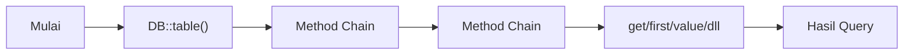
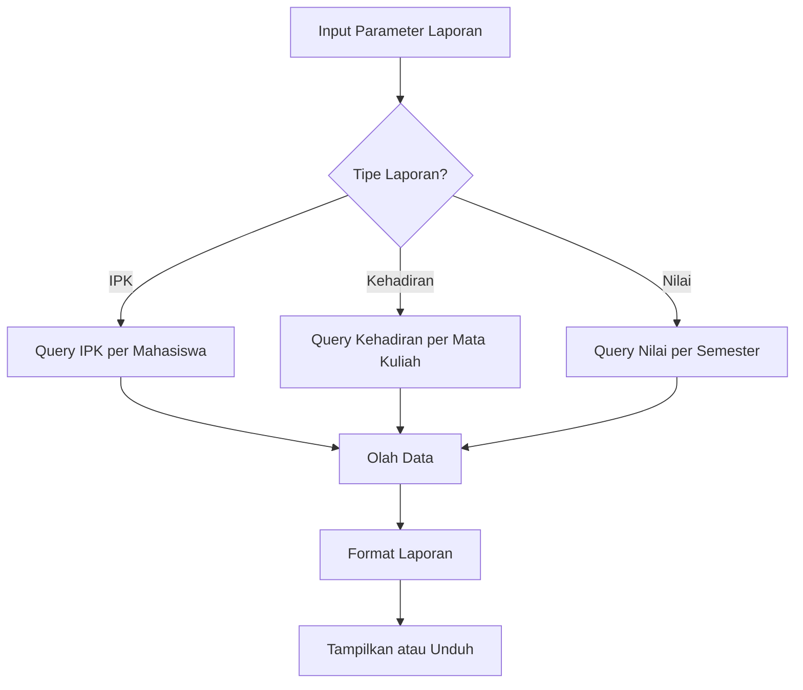

# Query Builder Lanjutan pada Laravel

Query Builder adalah salah satu fitur kuat Laravel yang menyediakan antarmuka yang mudah digunakan untuk membangun dan menjalankan kueri database. Pada pertemuan ini, kita akan membahas teknik query builder lanjutan yang akan membantu Anda mengelola data Mahasiswa secara lebih efisien.

## Apa itu Query Builder?

Query Builder Laravel adalah antarmuka berorientasi objek yang memungkinkan Anda membuat dan menjalankan kueri database tanpa harus menulis SQL mentah. Ini memberikan sintaks yang ekspresif dan aman untuk membangun kueri yang kompleks.



## Teknik Query Builder Lanjutan

### 1. Penggunaan Sub-Queries

Sub-queries memungkinkan Anda menyisipkan kueri di dalam kueri lain:

```php
$mahasiswaAktif = DB::table('mahasiswa')
    ->select('id', 'nama', 'nim')
    ->whereIn('jurusan_id', function($query) {
        $query->select('id')
              ->from('jurusan')
              ->where('status', 'aktif');
    })
    ->get();
```

### 2. Menggunakan Ekspresi SQL Mentah

Terkadang Anda perlu menggunakan fungsi database khusus:

```php
$mahasiswa = DB::table('mahasiswa')
    ->select(DB::raw('COUNT(*) as jumlah_mahasiswa, jurusan_id'))
    ->groupBy('jurusan_id')
    ->having(DB::raw('COUNT(*)'), '>', 10)
    ->get();
```

### 3. Union Queries

Menggabungkan hasil dari dua kueri:

```php
$mahasiswaS1 = DB::table('mahasiswa')
    ->where('jenjang', 'S1');

$mahasiswaS2 = DB::table('mahasiswa')
    ->where('jenjang', 'S2');

$allMahasiswa = $mahasiswaS1->union($mahasiswaS2)->get();
```

### 4. Conditional Query Methods

Menjalankan bagian kueri secara kondisional:

```php
$query = DB::table('mahasiswa');

// Cari berdasarkan nama jika parameter pencarian ada
if ($request->has('nama')) {
    $query->where('nama', 'like', '%' . $request->nama . '%');
}

// Filter berdasarkan jurusan jika parameter ada
if ($request->has('jurusan_id')) {
    $query->where('jurusan_id', $request->jurusan_id);
}

$mahasiswa = $query->get();
```

### 5. Agregasi Lanjutan

Menggunakan fungsi agregasi untuk analisis data:

```php
$statistik = DB::table('mahasiswa')
    ->select(
        DB::raw('AVG(nilai) as rata_rata_nilai'),
        DB::raw('MIN(nilai) as nilai_terendah'),
        DB::raw('MAX(nilai) as nilai_tertinggi'),
        'jurusan_id'
    )
    ->groupBy('jurusan_id')
    ->get();
```

### 6. Joins Kompleks

Menggabungkan beberapa tabel dengan kondisi kompleks:

```php
$mahasiswaLengkap = DB::table('mahasiswa')
    ->select('mahasiswa.nama', 'mahasiswa.nim', 'jurusan.nama as jurusan', 'dosen.nama as dosen_wali')
    ->join('jurusan', 'mahasiswa.jurusan_id', '=', 'jurusan.id')
    ->leftJoin('dosen', 'mahasiswa.dosen_wali_id', '=', 'dosen.id')
    ->whereNull('mahasiswa.deleted_at')
    ->orderBy('mahasiswa.nama')
    ->get();
```

## Contoh Studi Kasus: Laporan Akademik Mahasiswa

Mari lihat contoh kasus nyata untuk menerapkan query builder lanjutan dalam membuat laporan akademik mahasiswa:



Implementasi dalam kode:

```php
public function generateAcademicReport($mahasiswaId, $semesterId, $tipeReport)
{
    // Query dasar
    $query = DB::table('nilai')
        ->where('mahasiswa_id', $mahasiswaId)
        ->where('semester_id', $semesterId);
    
    // Modifikasi query berdasarkan tipe laporan
    switch ($tipeReport) {
        case 'ipk':
            $result = $query->select(
                DB::raw('SUM(nilai * sks) / SUM(sks) as ipk'),
                DB::raw('SUM(sks) as total_sks')
            )
            ->join('mata_kuliah', 'nilai.mata_kuliah_id', '=', 'mata_kuliah.id')
            ->first();
            break;
            
        case 'kehadiran':
            $result = $query->select(
                'mata_kuliah.nama as mata_kuliah',
                DB::raw('(presensi / total_pertemuan) * 100 as persentase_kehadiran')
            )
            ->join('mata_kuliah', 'nilai.mata_kuliah_id', '=', 'mata_kuliah.id')
            ->join('presensi', function ($join) {
                $join->on('nilai.mahasiswa_id', '=', 'presensi.mahasiswa_id')
                    ->on('nilai.mata_kuliah_id', '=', 'presensi.mata_kuliah_id');
            })
            ->get();
            break;
            
        case 'nilai':
            $result = $query->select(
                'mata_kuliah.nama as mata_kuliah',
                'mata_kuliah.sks',
                'nilai.nilai as nilai_angka',
                DB::raw('CASE 
                    WHEN nilai.nilai >= 85 THEN "A" 
                    WHEN nilai.nilai >= 75 THEN "B"
                    WHEN nilai.nilai >= 65 THEN "C"
                    WHEN nilai.nilai >= 50 THEN "D"
                    ELSE "E"
                END as nilai_huruf')
            )
            ->join('mata_kuliah', 'nilai.mata_kuliah_id', '=', 'mata_kuliah.id')
            ->orderBy('mata_kuliah.nama')
            ->get();
            break;
    }
    
    return $result;
}
```

## Tips Optimasi Query

1. **Gunakan Indexing**: Pastikan kolom yang sering digunakan untuk pencarian atau join memiliki index.

2. **Batasi Hasil**: Selalu gunakan pagination (`paginate()`) atau batasi jumlah hasil (`limit()`) untuk kueri yang potensial mengembalikan banyak data.

3. **Select Kolom Spesifik**: Hindari `select('*')` jika tidak diperlukan semua kolom.

4. **Gunakan Eager Loading**: Untuk relasi Eloquent, gunakan eager loading untuk menghindari N+1 query problem.

5. **Monitor Performa**: Gunakan Laravel Debugbar untuk memantau kueri yang dijalankan dan waktu eksekusinya.

## Kesimpulan

Query Builder lanjutan pada Laravel menyediakan alat yang sangat kuat untuk mengelola dan menganalisis data aplikasi Anda. Dengan penguasaan teknik-teknik ini, Anda dapat membuat kueri yang kompleks dengan sintaks yang mudah dibaca dan dipelihara.

Pada pertemuan selanjutnya, kita akan membahas hubungan Many-to-Many antara mahasiswa dan mata kuliah, dimana satu mahasiswa bisa mengambil banyak mata kuliah dan satu mata kuliah bisa diambil oleh banyak mahasiswa.