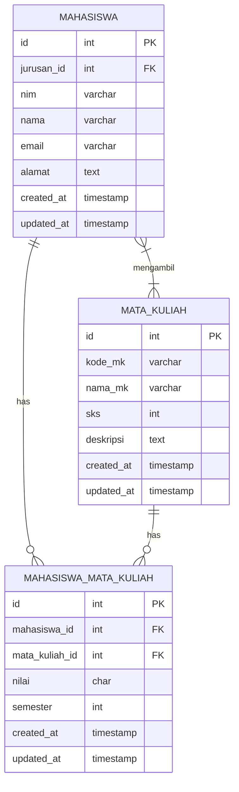
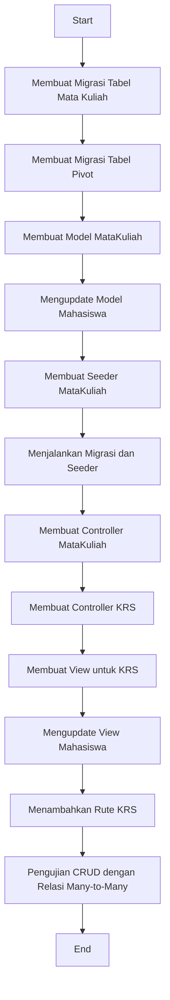

# Relationship Lanjutan: Relasi Many-to-Many di Laravel

Dalam tutorial ini, kita akan mempelajari cara mengimplementasikan relasi Many-to-Many di Laravel. Kita akan menggunakan contoh hubungan antara Mahasiswa dan Mata Kuliah, di mana satu Mahasiswa dapat mengambil banyak Mata Kuliah, dan satu Mata Kuliah dapat diambil oleh banyak Mahasiswa.

## Diagram Relasi Many-to-Many (Mahasiswa dan Mata Kuliah)



## Konsep Dasar Relasi Many-to-Many

Relasi Many-to-Many membutuhkan tabel pivot (penghubung) yang menyimpan foreign key dari kedua tabel yang berhubungan. Dalam contoh kita, tabel pivot bernama `mahasiswa_mata_kuliah` akan menyimpan `mahasiswa_id` dan `mata_kuliah_id`.

## Langkah 1: Membuat Migrasi untuk Tabel Mata Kuliah

```bash
php artisan make:migration create_mata_kuliahs_table
```

Edit file migrasi yang dibuat:

```php
public function up()
{
    Schema::create('mata_kuliahs', function (Blueprint $table) {
        $table->id();
        $table->string('kode_mk')->unique();
        $table->string('nama_mk');
        $table->integer('sks');
        $table->text('deskripsi')->nullable();
        $table->timestamps();
    });
}
```

## Langkah 2: Membuat Migrasi untuk Tabel Pivot

```bash
php artisan make:migration create_mahasiswa_mata_kuliah_table
```

Edit file migrasi tabel pivot:

```php
public function up()
{
    Schema::create('mahasiswa_mata_kuliah', function (Blueprint $table) {
        $table->id();
        $table->foreignId('mahasiswa_id')->constrained()->onDelete('cascade');
        $table->foreignId('mata_kuliah_id')->constrained()->onDelete('cascade');
        $table->char('nilai', 1)->nullable();
        $table->integer('semester');
        $table->timestamps();
        
        // Memastikan kombinasi mahasiswa_id dan mata_kuliah_id unik
        $table->unique(['mahasiswa_id', 'mata_kuliah_id', 'semester']);
    });
}
```

## Langkah 3: Membuat Model Mata Kuliah

```bash
php artisan make:model MataKuliah
```

Edit file model `app/Models/MataKuliah.php`:

```php
<?php

namespace App\Models;

use Illuminate\Database\Eloquent\Factories\HasFactory;
use Illuminate\Database\Eloquent\Model;

class MataKuliah extends Model
{
    use HasFactory;
    
    protected $fillable = ['kode_mk', 'nama_mk', 'sks', 'deskripsi'];
    
    // Relasi Many-to-Many ke Mahasiswa
    public function mahasiswas()
    {
        return $this->belongsToMany(Mahasiswa::class, 'mahasiswa_mata_kuliah')
                    ->withPivot('nilai', 'semester')
                    ->withTimestamps();
    }
}
```

## Langkah 4: Mengupdate Model Mahasiswa

Edit file `app/Models/Mahasiswa.php` untuk menambahkan relasi ke Mata Kuliah:

```php
<?php

namespace App\Models;

use Illuminate\Database\Eloquent\Factories\HasFactory;
use Illuminate\Database\Eloquent\Model;

class Mahasiswa extends Model
{
    use HasFactory;
    
    protected $fillable = ['jurusan_id', 'nim', 'nama', 'email', 'alamat'];
    
    // Relasi ke jurusan (Many-to-One)
    public function jurusan()
    {
        return $this->belongsTo(Jurusan::class);
    }
    
    // Relasi Many-to-Many ke Mata Kuliah
    public function mataKuliahs()
    {
        return $this->belongsToMany(MataKuliah::class, 'mahasiswa_mata_kuliah')
                    ->withPivot('nilai', 'semester')
                    ->withTimestamps();
    }
}
```

## Langkah 5: Membuat Seeder untuk Mata Kuliah

```bash
php artisan make:seeder MataKuliahSeeder
```

Edit file `database/seeders/MataKuliahSeeder.php`:

```php
<?php

namespace Database\Seeders;

use App\Models\MataKuliah;
use Illuminate\Database\Seeder;

class MataKuliahSeeder extends Seeder
{
    public function run()
    {
        $mataKuliahs = [
            ['kode_mk' => 'MK001', 'nama_mk' => 'Pemrograman Web', 'sks' => 3, 'deskripsi' => 'Mempelajari dasar-dasar pemrograman web'],
            ['kode_mk' => 'MK002', 'nama_mk' => 'Basis Data', 'sks' => 4, 'deskripsi' => 'Mempelajari konsep dan implementasi basis data'],
            ['kode_mk' => 'MK003', 'nama_mk' => 'Algoritma dan Struktur Data', 'sks' => 4, 'deskripsi' => 'Mempelajari konsep algoritma dan struktur data'],
            ['kode_mk' => 'MK004', 'nama_mk' => 'Kecerdasan Buatan', 'sks' => 3, 'deskripsi' => 'Pengenalan konsep kecerdasan buatan'],
        ];

        foreach ($mataKuliahs as $mk) {
            MataKuliah::create($mk);
        }
    }
}
```

Update file `database/seeders/DatabaseSeeder.php`:

```php
public function run()
{
    $this->call([
        JurusanSeeder::class,
        MataKuliahSeeder::class,
        // Seeder lainnya jika ada
    ]);
}
```

## Langkah 6: Menjalankan Migrasi dan Seeder

```bash
php artisan migrate
php artisan db:seed --class=MataKuliahSeeder
```

## Langkah 7: Membuat Controller untuk Mata Kuliah

```bash
php artisan make:controller MataKuliahController --resource
```

## Langkah 8: Membuat Controller untuk Mengelola KRS (Kartu Rencana Studi)

```bash
php artisan make:controller KrsController
```

Edit file `app/Http/Controllers/KrsController.php`:

```php
<?php

namespace App\Http\Controllers;

use App\Models\Mahasiswa;
use App\Models\MataKuliah;
use Illuminate\Http\Request;

class KrsController extends Controller
{
    // Menampilkan form untuk pilih mata kuliah
    public function create($mahasiswaId)
    {
        $mahasiswa = Mahasiswa::findOrFail($mahasiswaId);
        $mataKuliahs = MataKuliah::all();
        
        // Mendapatkan semester saat ini (bisa disesuaikan logic-nya)
        $currentSemester = date('n') <= 6 ? 2 : 1;
        
        return view('krs.create', compact('mahasiswa', 'mataKuliahs', 'currentSemester'));
    }
    
    // Menyimpan mata kuliah yang dipilih
    public function store(Request $request, $mahasiswaId)
    {
        $request->validate([
            'mata_kuliah_ids' => 'required|array',
            'mata_kuliah_ids.*' => 'exists:mata_kuliahs,id',
            'semester' => 'required|integer|min:1'
        ]);
        
        $mahasiswa = Mahasiswa::findOrFail($mahasiswaId);
        
        // Simpan ke tabel pivot dengan semester
        foreach ($request->mata_kuliah_ids as $mkId) {
            // Periksa apakah relasi sudah ada untuk semester yang sama
            if (!$mahasiswa->mataKuliahs()->wherePivot('semester', $request->semester)->wherePivot('mata_kuliah_id', $mkId)->exists()) {
                $mahasiswa->mataKuliahs()->attach($mkId, [
                    'semester' => $request->semester
                ]);
            }
        }
        
        return redirect()->route('mahasiswas.show', $mahasiswa->id)
            ->with('success', 'Mata kuliah berhasil ditambahkan ke KRS');
    }
    
    // Menampilkan KRS mahasiswa
    public function show($mahasiswaId, $semester = null)
    {
        $mahasiswa = Mahasiswa::findOrFail($mahasiswaId);
        
        // Jika semester tidak ditentukan, ambil semester terbaru
        if (!$semester) {
            $latestKrs = $mahasiswa->mataKuliahs()
                        ->orderByPivot('semester', 'desc')
                        ->first();
            $semester = $latestKrs ? $latestKrs->pivot->semester : 1;
        }
        
        $mataKuliahs = $mahasiswa->mataKuliahs()
                      ->wherePivot('semester', $semester)
                      ->get();
        
        return view('krs.show', compact('mahasiswa', 'mataKuliahs', 'semester'));
    }
    
    // Menghapus mata kuliah dari KRS
    public function destroy($mahasiswaId, $mataKuliahId, $semester)
    {
        $mahasiswa = Mahasiswa::findOrFail($mahasiswaId);
        
        $mahasiswa->mataKuliahs()->wherePivot('semester', $semester)->detach($mataKuliahId);
        
        return redirect()->route('krs.show', [$mahasiswaId, $semester])
            ->with('success', 'Mata kuliah berhasil dihapus dari KRS');
    }
    
    // Input nilai untuk mata kuliah
    public function inputNilai($mahasiswaId, $mataKuliahId, $semester)
    {
        $mahasiswa = Mahasiswa::findOrFail($mahasiswaId);
        $mataKuliah = MataKuliah::findOrFail($mataKuliahId);
        
        return view('krs.input_nilai', compact('mahasiswa', 'mataKuliah', 'semester'));
    }
    
    // Menyimpan nilai mata kuliah
    public function storeNilai(Request $request, $mahasiswaId, $mataKuliahId, $semester)
    {
        $request->validate([
            'nilai' => 'required|in:A,B,C,D,E'
        ]);
        
        $mahasiswa = Mahasiswa::findOrFail($mahasiswaId);
        
        $mahasiswa->mataKuliahs()->updateExistingPivot($mataKuliahId, [
            'nilai' => $request->nilai
        ]);
        
        return redirect()->route('krs.show', [$mahasiswaId, $semester])
            ->with('success', 'Nilai berhasil disimpan');
    }
}
```

## Langkah 9: Membuat View untuk KRS

Buat direktori dan file view untuk KRS:

```bash
mkdir -p resources/views/krs
```

### File: resources/views/krs/create.blade.php

```html
@extends('layouts.app')

@section('content')
<div class="container">
    <h2>Tambah Mata Kuliah ke KRS - {{ $mahasiswa->nama }} (Semester {{ $currentSemester }})</h2>
    
    <form action="{{ route('krs.store', $mahasiswa->id) }}" method="POST">
        @csrf
        <input type="hidden" name="semester" value="{{ $currentSemester }}">
        
        <div class="form-group">
            <p><strong>NIM:</strong> {{ $mahasiswa->nim }}</p>
            <p><strong>Jurusan:</strong> {{ $mahasiswa->jurusan->nama_jurusan }}</p>
        </div>
        
        <div class="form-group">
            <label>Pilih Mata Kuliah</label>
            <div class="row">
                @foreach ($mataKuliahs as $mk)
                <div class="col-md-6">
                    <div class="card mb-2 p-2">
                        <div class="form-check">
                            <input class="form-check-input" type="checkbox" name="mata_kuliah_ids[]" value="{{ $mk->id }}" id="mk-{{ $mk->id }}">
                            <label class="form-check-label" for="mk-{{ $mk->id }}">
                                <strong>{{ $mk->kode_mk }} - {{ $mk->nama_mk }}</strong> ({{ $mk->sks }} SKS)
                                <p class="text-muted small">{{ $mk->deskripsi }}</p>
                            </label>
                        </div>
                    </div>
                </div>
                @endforeach
            </div>
        </div>
        
        <button type="submit" class="btn btn-primary">Simpan KRS</button>
        <a href="{{ route('mahasiswas.show', $mahasiswa->id) }}" class="btn btn-secondary">Kembali</a>
    </form>
</div>
@endsection
```

### File: resources/views/krs/show.blade.php

```html
@extends('layouts.app')

@section('content')
<div class="container">
    <h2>Kartu Rencana Studi (KRS)</h2>
    <h4>{{ $mahasiswa->nama }} ({{ $mahasiswa->nim }})</h4>
    <p>Jurusan: {{ $mahasiswa->jurusan->nama_jurusan }} | Semester: {{ $semester }}</p>
    
    @if (session('success'))
        <div class="alert alert-success">
            {{ session('success') }}
        </div>
    @endif
    
    <div class="mb-3">
        <a href="{{ route('krs.create', $mahasiswa->id) }}" class="btn btn-primary">Tambah Mata Kuliah</a>
        <a href="{{ route('mahasiswas.show', $mahasiswa->id) }}" class="btn btn-secondary">Kembali ke Profil</a>
    </div>
    
    <div class="card">
        <div class="card-header">
            <div class="row">
                <div class="col-md-6">
                    <h5 class="mb-0">Daftar Mata Kuliah</h5>
                </div>
                <div class="col-md-6 text-right">
                    <form action="{{ route('krs.show', $mahasiswa->id) }}" method="GET" class="form-inline justify-content-end">
                        <div class="form-group">
                            <label for="semester" class="mr-2">Pilih Semester:</label>
                            <select name="semester" id="semester" class="form-control form-control-sm mr-2" onchange="this.form.submit()">
                                @for ($i = 1; $i <= 8; $i++)
                                    <option value="{{ $i }}" {{ $semester == $i ? 'selected' : '' }}>Semester {{ $i }}</option>
                                @endfor
                            </select>
                        </div>
                    </form>
                </div>
            </div>
        </div>
        <div class="card-body">
            @if ($mataKuliahs->count() > 0)
                <table class="table">
                    <thead>
                        <tr>
                            <th>No</th>
                            <th>Kode</th>
                            <th>Mata Kuliah</th>
                            <th>SKS</th>
                            <th>Nilai</th>
                            <th>Aksi</th>
                        </tr>
                    </thead>
                    <tbody>
                        @php $totalSks = 0; @endphp
                        @foreach ($mataKuliahs as $i => $mk)
                        <tr>
                            <td>{{ $i + 1 }}</td>
                            <td>{{ $mk->kode_mk }}</td>
                            <td>{{ $mk->nama_mk }}</td>
                            <td>{{ $mk->sks }}</td>
                            <td>
                                @if ($mk->pivot->nilai)
                                    <span class="badge badge-{{ $mk->pivot->nilai == 'A' || $mk->pivot->nilai == 'B' ? 'success' : ($mk->pivot->nilai == 'C' ? 'warning' : 'danger') }}">
                                        {{ $mk->pivot->nilai }}
                                    </span>
                                @else
                                    <a href="{{ route('krs.input-nilai', [$mahasiswa->id, $mk->id, $semester]) }}" class="btn btn-sm btn-outline-primary">Input Nilai</a>
                                @endif
                            </td>
                            <td>
                                <form action="{{ route('krs.destroy', [$mahasiswa->id, $mk->id, $semester]) }}" method="POST" class="d-inline">
                                    @csrf
                                    @method('DELETE')
                                    <button type="submit" class="btn btn-sm btn-danger" onclick="return confirm('Yakin ingin menghapus mata kuliah ini dari KRS?')">Hapus</button>
                                </form>
                            </td>
                        </tr>
                        @php $totalSks += $mk->sks; @endphp
                        @endforeach
                        <tr>
                            <td colspan="3" class="text-right"><strong>Total SKS:</strong></td>
                            <td><strong>{{ $totalSks }}</strong></td>
                            <td colspan="2"></td>
                        </tr>
                    </tbody>
                </table>
            @else
                <div class="alert alert-info">
                    Belum ada mata kuliah yang diambil pada semester {{ $semester }}.
                </div>
            @endif
        </div>
    </div>
</div>
@endsection
```

### File: resources/views/krs/input_nilai.blade.php

```html
@extends('layouts.app')

@section('content')
<div class="container">
    <h2>Input Nilai Mata Kuliah</h2>
    <h4>{{ $mahasiswa->nama }} ({{ $mahasiswa->nim }})</h4>
    <p>Mata Kuliah: {{ $mataKuliah->kode_mk }} - {{ $mataKuliah->nama_mk }} | Semester: {{ $semester }}</p>
    
    <form action="{{ route('krs.store-nilai', [$mahasiswa->id, $mataKuliah->id, $semester]) }}" method="POST">
        @csrf
        
        <div class="form-group">
            <label for="nilai">Nilai</label>
            <select name="nilai" id="nilai" class="form-control @error('nilai') is-invalid @enderror">
                <option value="">-- Pilih Nilai --</option>
                <option value="A">A</option>
                <option value="B">B</option>
                <option value="C">C</option>
                <option value="D">D</option>
                <option value="E">E</option>
            </select>
            @error('nilai')
                <div class="invalid-feedback">{{ $message }}</div>
            @enderror
        </div>
        
        <button type="submit" class="btn btn-primary">Simpan Nilai</button>
        <a href="{{ route('krs.show', [$mahasiswa->id, $semester]) }}" class="btn btn-secondary">Kembali</a>
    </form>
</div>
@endsection
```

## Langkah 10: Mengupdate View Mahasiswa untuk Menampilkan KRS

Edit file `resources/views/mahasiswas/show.blade.php`:

```html
@extends('layouts.app')

@section('content')
<div class="container">
    <h2>Detail Mahasiswa</h2>
    
    @if (session('success'))
        <div class="alert alert-success">
            {{ session('success') }}
        </div>
    @endif
    
    <div class="card mb-4">
        <div class="card-header">
            <h5 class="mb-0">Informasi Mahasiswa</h5>
        </div>
        <div class="card-body">
            <div class="row">
                <div class="col-md-6">
                    <p><strong>NIM:</strong> {{ $mahasiswa->nim }}</p>
                    <p><strong>Nama:</strong> {{ $mahasiswa->nama }}</p>
                    <p><strong>Email:</strong> {{ $mahasiswa->email }}</p>
                    <p><strong>Jurusan:</strong> {{ $mahasiswa->jurusan->nama_jurusan }}</p>
                </div>
                <div class="col-md-6">
                    <p><strong>Alamat:</strong></p>
                    <p>{{ $mahasiswa->alamat ?: '-' }}</p>
                </div>
            </div>
        </div>
        <div class="card-footer">
            <a href="{{ route('mahasiswas.edit', $mahasiswa->id) }}" class="btn btn-warning">Edit</a>
            <a href="{{ route('mahasiswas.index') }}" class="btn btn-secondary">Kembali</a>
        </div>
    </div>
    
    <div class="card">
        <div class="card-header">
            <h5 class="mb-0">Kartu Rencana Studi (KRS)</h5>
        </div>
        <div class="card-body">
            <a href="{{ route('krs.show', $mahasiswa->id) }}" class="btn btn-primary">Lihat KRS</a>
            <a href="{{ route('krs.create', $mahasiswa->id) }}" class="btn btn-success">Tambah Mata Kuliah</a>
        </div>
    </div>
</div>
@endsection
```

## Langkah 11: Menambahkan Rute untuk KRS

Edit file `routes/web.php`:

```php
// Rute untuk KRS (Kartu Rencana Studi)
Route::get('mahasiswas/{mahasiswa}/krs/create', [KrsController::class, 'create'])->name('krs.create');
Route::post('mahasiswas/{mahasiswa}/krs', [KrsController::class, 'store'])->name('krs.store');
Route::get('mahasiswas/{mahasiswa}/krs/{semester?}', [KrsController::class, 'show'])->name('krs.show');
Route::delete('mahasiswas/{mahasiswa}/krs/{mataKuliah}/{semester}', [KrsController::class, 'destroy'])->name('krs.destroy');
Route::get('mahasiswas/{mahasiswa}/krs/{mataKuliah}/{semester}/nilai', [KrsController::class, 'inputNilai'])->name('krs.input-nilai');
Route::post('mahasiswas/{mahasiswa}/krs/{mataKuliah}/{semester}/nilai', [KrsController::class, 'storeNilai'])->name('krs.store-nilai');
```

## Flowchart Implementasi Relasi Many-to-Many



## Implementasi Query dan Penggunaan Relasi

Berikut adalah contoh penggunaan relasi Many-to-Many di controller:

### Menambahkan Data ke Tabel Pivot (Attach)

```php
// Menambahkan mata kuliah ke mahasiswa
$mahasiswa = Mahasiswa::find(1);
$mahasiswa->mataKuliahs()->attach(1, ['semester' => 1]); // Menambahkan mata kuliah dengan ID 1

// Menambahkan beberapa mata kuliah sekaligus
$mahasiswa->mataKuliahs()->attach([
    1 => ['semester' => 1], 
    2 => ['semester' => 1]
]);
```

### Menghapus Data dari Tabel Pivot (Detach)

```php
// Menghapus mata kuliah dari mahasiswa
$mahasiswa->mataKuliahs()->detach(1); // Menghapus mata kuliah dengan ID 1

// Menghapus semua mata kuliah dari mahasiswa
$mahasiswa->mataKuliahs()->detach();
```

### Sinkronisasi Data (Sync)

```php
// Mengatur mata kuliah mahasiswa menjadi hanya yang disebutkan
$mahasiswa->mataKuliahs()->sync([
    1 => ['semester' => 1], 
    3 => ['semester' => 1]
]); // Hanya akan ada mata kuliah ID 1 dan 3
```

### Mengupdate Data di Tabel Pivot

```php
// Mengupdate nilai di tabel pivot
$mahasiswa->mataKuliahs()->updateExistingPivot(1, ['nilai' => 'A']);
```

### Query Data dengan Kondisi di Tabel Pivot

```php
// Mencari mahasiswa yang mengambil mata kuliah tertentu
$mahasiswaMk1 = Mahasiswa::whereHas('mataKuliahs', function($query) {
    $query->where('mata_kuliah_id', 1);
})->get();

// Mencari mahasiswa dengan nilai A pada mata kuliah tertentu
$mahasiswaNilaiA = Mahasiswa::whereHas('mataKuliahs', function($query) {
    $query->where('mata_kuliah_id', 1)
          ->where('nilai', 'A');
})->get();

// Mencari mata kuliah yang diambil oleh mahasiswa tertentu pada semester tertentu
$mataKuliahSemester1 = MataKuliah::whereHas('mahasiswas', function($query) use ($mahasiswaId) {
    $query->where('mahasiswa_id', $mahasiswaId)
          ->where('semester', 1);
})->get();
```

### Eager Loading untuk Optimasi Query

```php
// Load mahasiswa beserta mata kuliah yang diambil
$mahasiswas = Mahasiswa::with('mataKuliahs')->get();

// Load mata kuliah beserta mahasiswa yang mengambil
$mataKuliahs = MataKuliah::with('mahasiswas')->get();

// Load mahasiswa dengan mata kuliah dan jurusan
$mahasiswas = Mahasiswa::with(['mataKuliahs', 'jurusan'])->get();
```

## Kesimpulan

Dalam tutorial ini, kita telah mempelajari:

1. Konsep relasi Many-to-Many di Laravel
2. Cara membuat tabel pivot untuk menghubungkan dua tabel
3. Implementasi relasi di model Laravel menggunakan `belongsToMany()`
4. Menyimpan data tambahan di tabel pivot menggunakan `withPivot()`
5. Berbagai metode untuk mengelola data relasi: `attach()`, `detach()`, `sync()`, dan `updateExistingPivot()`
6. Melakukan query dengan kondisi di tabel pivot
7. Optimasi query menggunakan eager loading

Dengan implementasi relasi Many-to-Many ini, aplikasi manajemen data Mahasiswa kita sekarang dapat mengelola KRS dengan lebih efisien, memungkinkan mahasiswa untuk mengambil banyak mata kuliah dan mata kuliah dapat diambil oleh banyak mahasiswa.